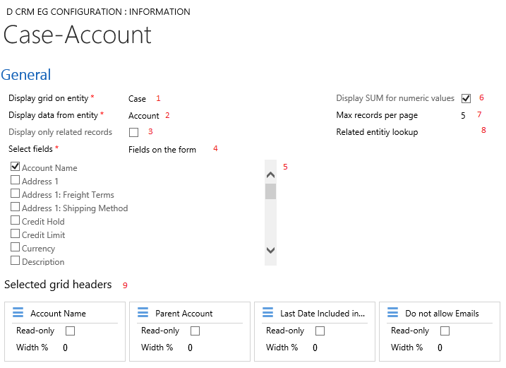

## Configuration Page

# Select the entity where the grid is to be displayed
# Select the entity where grid data is to be pulled from
# If a 1:N relationship between the two entities exists, the check box will be checked and the "Related entity lookup" field will be populated with the schema name for the lookup from the relation ship page If "Display only related records" is checked, the grid will only fetch related records, otherwise the grid will fetch all records
# Filters as what fields to display. Fields on the form (default). Custom or System fields. And All fields.
	* The following fields are not included in the results:
		* createdby, createdon, createdonbehalfby, exchangerate, importsequencenumber, modifiedby, modifiedon, modifiedonbehalfby, overriddencreatedon, owningbusinessunit, owningteam, owninguser, statecode, statuscode, timezoneruleversionnumber, utcconversiontimezonecode, versionnumber
# After making a selection in 2, the "Selected Fields" list should be populated. Mouse over each field to see it's metadata. Selecting a fields will add it to the grid. Deselecting it, will remove it from the grid.
# Controls whether to display summary for numeric and currency fields. Can be changed from the grid
# Controls pager's number of records to display. Can be changed from the grid
# Related lookup name from relation page
# Selected grid headers represents the selected fields. Can be set to read only. The grid column width can be adjusted. it is in percentage. A value of 0 will cause the grid to spread the width evenly amongst headers.