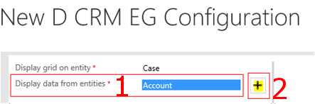
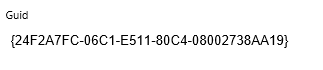
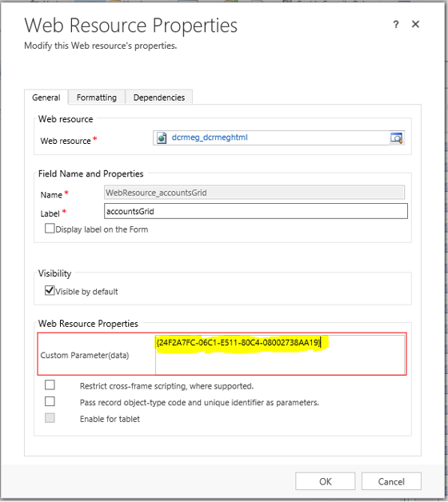

# Display Entities on Different Sections of the Same Form

## Configuration for the first grid

**Create a new "D CRM EG Configuration"**

**Select an entity to display the grid on. Example Case**

**Select and two entites to the list of entities to be displayed. Example Account and Contact**

**Drag Contact entity and drop it on the Account entity**

**If the drag entity (Contact) has many to one relationship with the dropped entity (Account), you will have the option to display related Contacts or all Contacts.**

**Select fields for Account and Contact**

**Save the new configuration.**
**Copy the Guid of the new configuration to a a temporary text editor.**

**Close the new configuration.**

## Configuration for the second grid

**Create a new "D CRM EG Configuration"**
**Select an entity to display the grid on. Case**
**Select Account entity and add it to the list of entities to be displayed.**
**Select fields for the Account entity.**
**Save the new configuration.**
**Copy the Guid of the new configuration to a a temporary text editor.**
**Close the new configuration.**

## Setting up the web resource for Case-Account-Contact and Case-Account D CRM EG Configurations

**Open any "Case" record. Find and click "Form Editor" menu item.**

**In the form editor, add a new "One Column Tab" to the form.**

**Open up the new tab's properties (DbClick or use properties tool-bar button). Uncheck "Show the label for this tab on the form" check box. Click OK button.**

**Add a new web resource to the tab.**

**For the web resource, enter "dcrmeg_dcrmeghtml". Enter a name for the web resource.**

**Paste the GUID for the first configuration to the "Custome Parameters {data}" field**

**Click on the "Formatting" tab of the new Add Web Resource window.**

**Set the "Number of rows" to 20. Uncheck "Display border". Click OK.**

## Repeat "Setting up the web resource" for the second configuration

**Save and publish the changes to the case form.**

**Refresh the case record. You should see two grids on different sections of the form.**

