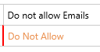
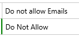
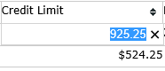
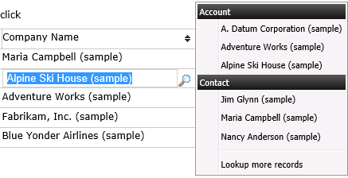
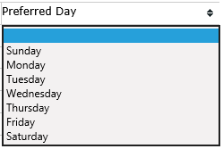
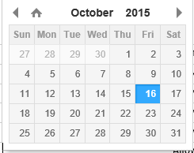
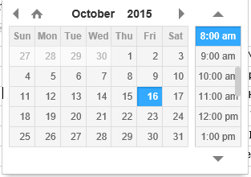

## Editors

**Activating an editor:**

* Mouse: Click on the cell
* Keyboard: Pressing the Enter key when a cell has focus

**Change the value:**

* Text, and Numeric (decimal, float, whole number, and money). Enter value and press the Enter or Tab key or click outside.
* Optionset. Selecting a value from the optionset
* Lookup, Selecting an item form the drop down list
* Two Option (checkbox). Changing the check state
* DateTime. Selecting a value from datetime drop down
* Description (Memo). clicking on the OK button of the flyout dialog

Note:
After the value of a cell changes, the text colour changes as well to indicate a changed cell.

Value modified, not saved

Value modified, saved

**Cancelling edit:**
To cancel editing press the ESC key or click outside of the editor.

## Screenshots

**Text and Numeric**
 

**Memo**

**Lookup**
 

**OptionSet**

**Two option - Checked**

**Two option - Unchecked**

**Date and Time**
 

