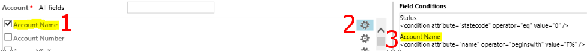
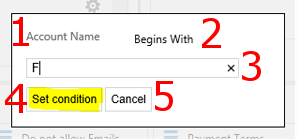
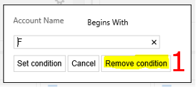
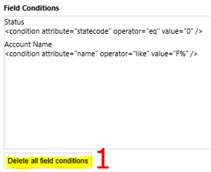

## Field Conditions

**Click #2 (field condition button) or #3 to open the field condition dialog.**

**Field condition dialog.**

# Displays the field label
# A drop down similar to Advanced find allowing you to set various conditions
# Text box to enter a value for the condition
# Sets/updates the condition
# Cancels the field condition dialog

**Remove a condition.**

**Remove all conditions.**

