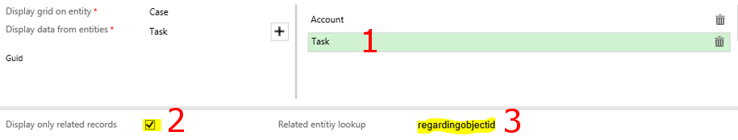
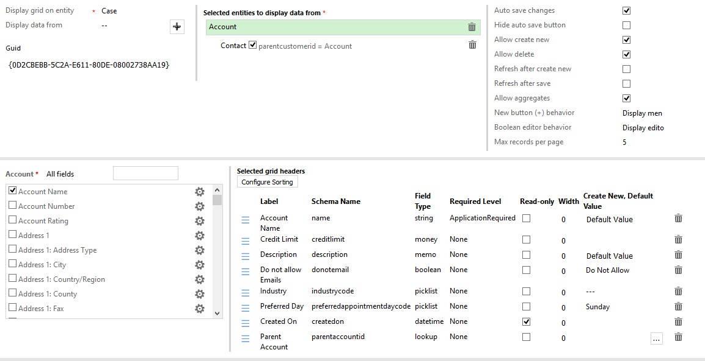

## Setting up D CRM EG Configuration

**Open "Advanced Find" and look for and select "D CRM EG Configuration" list option. Click on the "results" tool-bar button.**

**Under the tab "List Tools", click "New D CRM EG Configuration" tool-bar button.**

**In the new configuration window, select the entity where the grid is to be displayed on. Example, Case.**

**Select an entity to display data from. Example Account.**

**Click on the "+" button to add the selected entity to the list of entities to display data from .**

**Click to select the new "Account" entity list item. This will display a list of all fields for the entity and other  configuration settings.**

**If a selected entity has a many to one relationship with the entity hosting the grid, you will be presented with the option to use this relationship to display only related records or all records.**

**By default, all the fields for the entity are displayed. Changing "All Fields" drop down option to other options such as "Fields on the form" will display a subset of all the fields for the entity.**

**The text box to the right of the fields' display drop down can be used for searching for a field rather than scrolling.**

**Select the fields that you would like to be displayed on the grid. Each selected field will have a corresponding tile under the "Selected grid headers" section.**

**Each selected field can be set to read-only. It's initial width can also be specified in percentage. And a default value can v=be set for create new**

**To re-arrange the field display order, drag and drop the tiles under the "Selected grid headers" section.**

**Set:**
# Auto save changes
# Show auto save button
# Allow user to create new records
# Allow user to delete records
# Refresh grid after creating in line record
# Refresh grid after saving changes
# Allow display Aggregate icon for numeric fields
# Set the behaviour of (+) button. Display menu (inline, window), inline, window
# Set how boolean (two option) editor changes. One click or display editor
# Set the initial number of records per page if the number of records exceed five.*

**Save and close the new configuration record.**

## Setting up the web resource

**Open any "Case" record. Find and click "Form Editor" menu item.**

**In the form editor, add a new "One Column Tab" to the form.**

**Open up the new tab's properties (DbClick or use properties tool-bar button). Uncheck "Show the label for this tab on the form" check box. Click OK button.**

**Add a new web resource to the tab.**

**For the web resource, enter "dcrmeg_dcrmeghtml". Enter a name for the web resource.**

**Click on the "Formatting" tab of the new Add Web Resource window.**

**Set the "Number of rows" to 12. Uncheck "Display border". Click OK.**

**Save and publish the changes to the case form.**

**Refresh the case record. You should see a grid displaying selected fields from the "Account" entity.**

