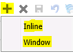

## Grid Toolbar

Displays the entity name and the total number of records retrieved for the entity

New record functionality. Inline (adds new record to grid directly) or window (default CRM behaviour)

After confirmation, deletes selected records from the grid

Saves any modified field in the grid

Undo change. Undo changes (unlimited) for a modified field in the grid

Undo all changes. Resets all the modified fields on the grid to their original values prior to modifications

Export the grid data in Excel, PDF, or CSV formats

Clear all filters

Refresh grid

Auto save changes (can be hidden from configuration)

Go to first page

Go to previous page

Go to next page

